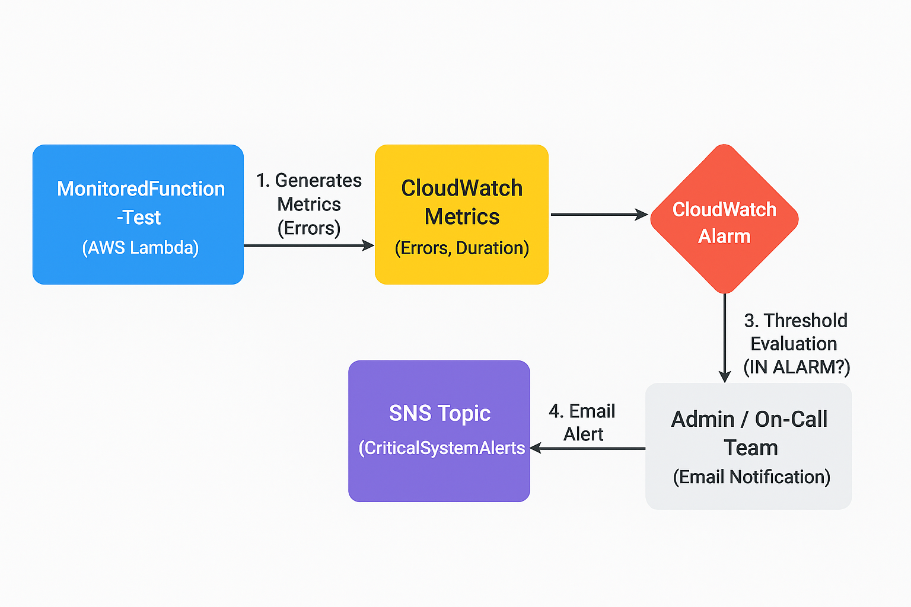
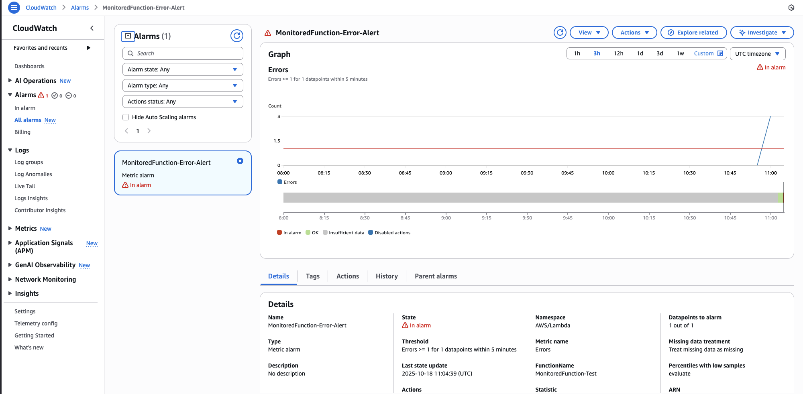
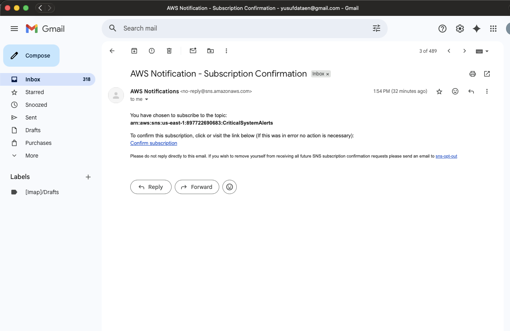
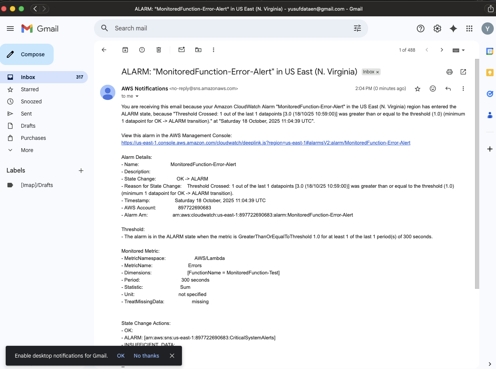

## Monitoring and Alerting System (CloudWatch+SNS)

This project demonstrates the implementation of a fully automated, serverless alert notification system crucial for DevOps and Site Reliability Engineering (SRE) practices. The system monitors the health and performance of a critical application (simulated by an AWS Lambda function) and notifies on-call teams instantly via email upon failure.

## System Architecture and Flow

The architecture is built on the principle of centralized monitoring and instant, event-driven notification.

    Monitoring Target: A simulated Lambda function (MonitoredFunction-Test) generates performance and error metrics.

    Alerting Engine (CloudWatch): Continuously evaluates the incoming metrics against a predefined threshold.

    Notification Service (SNS): Serves as the central communication channel, instantly distributing the alert message.

    Endpoint: The alert is received by the designated recipient (e-mail address).

Architecture Diagram:

## Key Technical Achievements

This project showcases expertise in operational security and proactive system management:

    Metric Selection & Thresholding: Created a CloudWatch Alarm specifically targeting the Errors metric for the monitored Lambda function. The threshold was set to trigger the alarm if the sum of errors was ≥1 within a 5-minute period.

    Serverless Notification Setup: Successfully configured and validated an SNS Topic (CriticalSystemAlerts) and ensured the email subscription was confirmed, proving reliable communication channel setup.

    End-to-End Validation: The system's integrity was proven by intentionally introducing a failure into the Lambda function (using throw new Error). CloudWatch correctly transitioned the alarm state to IN ALARM, and the notification was instantly delivered via SNS to the subscribed email address.

## Visual Documentation Checklist

    CloudWatch Alarm :

    SNS Topic/Subscription Mail:

    Working Proof :

